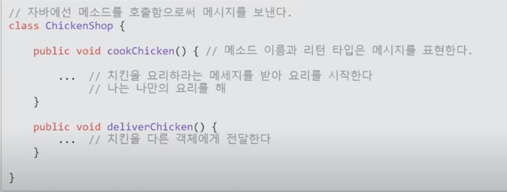

# 프로그래밍

* 문제를 분석해 문제를 해결하는 방법과 과정. (Problem Solving)
* 조직화하는 것을 '설계'라 함.
* 구조적 프로그래밍에서의 분할기준은 프로시저(절차, 함수).
* 절차지향과 차이점은 캡슐화, 다형성, 상속 지원, 데이터 접근 제한을 걸 수 있는지 여부.
* 효율적으로 하기 위한 방법론 중 하나가 객체지향.
* 알고리즘은 수학적인 풀이. 하지만 이로 모든 문제를 해결 할 수 없음.
* 객체지향은 어떤 문제를 잘게 나눠서 각각의 `능동적인 주체`로 만들기 위함.
* 잘게 나눈 객체들을 조합해 큰 문제를 해결하는 Bottom-Up 지향
* 큰 문제를 10개로 나눠 할당하고 각 주체가 자기가 맡은 책임에 대해 해결을 위해 '자율적'으로 노력하고 '협업'하기 위한 패러다임.
* 즉 객체지향에서 우리가 배워야 할 것은 '협력'하는 방법이고 그 방법론들을 배워야함.
* 점은 객체고 선은 협력과 구조. 점보다 선에 신경써야함.

 

 

# OOP

1. 객체지향 프로그래밍이란?
2. 키워드로 보는 객체지향
3. 객체지향적인 치킨집 만들기

 

 

## 1. 객체지향 프로그래밍이란?

* 개발 방법론(이렇게 개발 해야한다.)
* 사람이 현실을 바라보는 방법을 개발에 접목
  * 직관적 이해
  * 유지보수 용이
* 데이터 중심 설계는 협력의 관점에서 문맥을 고려하지 않기 때문에 응집도가 변경에 취약하게 되어 SRP(single Responsibility Princuple) 단일 책임 원칙을 위한할 가능성이 큼.

 

 

## 2. 키워드로 알아보는 객체지향

* 객체
* 협력과 책임, 역할
* 메시지
* 자율성 (의인화)
* 다형성

 

### 객체란 무엇인가?

* 객체는 현실의 무언가를 대응하는 추상적 개념
* class는 객체를 표현하는 하나의 수단 (class != 객체)
* 다른 객체와 `협력`하는 `역할`을 맡고 있는 대상
* `역할`을 맡으면 임무를 수행할 `책임`이 생긴다.

 

#### 협력과 책임, 역할

* 협력(Collaboration) 이란?

  * 시스템 목표를 달성하기 위해 여러 객체가 참여하여 행동하는 것.

    (ex) 치킨을 튀겨서 손님에게 배달해야 한다.

* 책임(reaponsbility) 란?

  * 협력 속에서 본인이 수행해야 할 임무의 내용을 알고, 수행하는 것

    (ex) 치킨을 튀길 객체는 치킨을 맛있게 요리할 책임을 가진다.

* 역할(role) 이란?

  * 동일한 목적을 가진 책임의 묶음

    (ex) 치킨을 조리할 책임을 가지는 역할은 요리사이다.

 

#### 메시지 ( 드러난 행동, 숨겨진 상태 = 캡슐화, 정보은닉)

* 객체는 메시지를 통해 다른 객체에 책임을 다하라고 요구한다.
* 메시지를 보내는 객체는 무엇을 할지만 요구하고, 어떻게 하는지는 신경쓰지 않아도 된다.
* 객체는 책임을 수행하라고 요구받지만, 어떻게 처리할 지는 자율에 맡긴다.
* 도움을 요청하는 것으 메시지 패싱. 베시지를 받았을때 실행되는 함수나 프로시저는 메서드.

 

 

#### 자율성 (의인화)

* 객체지향과 현실세계의 차이점
  * 현실의 치킨 가게는 건물에 불과
  * 객체지향을 치킨 가게는 스스로 치킨을 튀기고 배달해줌.

* 즉 객체지향에서는 객체가 자율적으로 능동적으로 행동할 수 있다고 의인화 되어야 한다.
* 자율적으로 메시지를 처리하기 위해서 자신의 책임을 수행하는 데 필요한 데이터와 프로세스를 가지고 있다.

 

#### 다형성

* 서로 다른 유형의 객체가 동일한 메시지에 대해 다르게 반응하기 위해서
* 동일한 메시지를 처리한다 == 같은 역할을 수행한다.
* 다르게 반응한다 == 메시지 처리방법은 자율적이다.

 

 

## 요약

1. 객체는 현실의 개념을 추상화(의인화)한 것.
2. 객체들은 서로 협력하고 역할을 맡아 책임을 수행하여 문제를 해결한다. ( 시스템 목표를 수행한다.)
3. 현실의 사물과 달리 능동적이고 자율적인 존재이다.

 

 

## 객체지향적 책임 주도 설계 해보기. (grasp 패턴 학습)

* 주의할 점 : 현실 중심의 데이터 중심 설계를 하기 쉬움(요리사, 전화기, 배달 도착지, 돈...)

* 데이터 중심 설계. getter, setter가 과도하게 추가되어 결합도가 높아진다. (서로 알고있는 객체가 너무 많아진다.)

* 하나의 변경이 일어났을 때 수정해야 할 것이 너무 많아짐. ( 유지보수성 하락 )

* 데이터를 처리하는 작업과 데이터가 분리되어 응집도도 낮아진다. ( 하나의 일을 여러 객체가 같이하게 됨. 변경될 일이 많아짐 )

 

 

### 책임 주도 개발

1. 시스템이 사용자에게 제공해야 하는 기능인 시스템 책임 ( 협력 ) 을 파악.
2. 시스템 책임을 더 작은 책임으로 분할한다.
3. 분할된 책임을 수행 할 수 있는 적절한 객체 또는 역할을 찾아 책임을 할당.
4. 객체가 팩임을 수행하는 도중 다른 객체의 도움이 필요한 경우 이를 책임질 적절한 객체 또는 역할을 찾는다.
5. 해당 객체 또는 역할에게 책임을 할당함으로써 두 객체가 협력하게 한다.

 

 

1. 치킨 주문을 받아 손님에게 배달해야한다.
2. 메시지를 생성한다.(주문을 받는다, 치킨을 요리한다, 치킨을 손님에게 배달한다.)

3. 치킨 가게에게 주문메시지를 할당. 
4. 요리는 요리사, 배달은 배달원 객체의 협력
5. 책임을 할당하고 메시지를 전달(메서드로 표현)

 

> 책임만 수행하면 그 안에서 뭘하든 상관없다. 책임만 수행하면 객체지향 설계이다.

 

 

#### 캡슐화, 은닉성

* 외부에서 명령할 것들만 public, 내부구조는 private로 감춰놓음
* 은닉성으로 우리는 남이 만든 class라도 일일히 뜯어볼 필요 없이 기능만 가져다 쓸 수 있음.

 

 

#### Interface ( = 겉으로 드러난 행동에 대해 정의)

 

* 청소라는 동일한 메서드로 일을 시킬 수 있게 override함.

* 인터페이스로 묶여야 가능함.

 

 

* 학생단위 -> 교실단위로 묶음

* 상속받은 자식클래스.

 

 

## 추상 클래스 ( 타입과 추상화, 일반화된것과 특수화된것들)

* 추상화는 현실을 관찰하여 핵심적인 공통점을 뽑아낸 것.

* 겉으로 드러난게 같으면 같은 타입 ( 공용 인터페이스가 같으면 같은 타입)
* 서로 대체 가능성이 있다 = 다형성. (OOP의 특징)

* 추상클래스로는 객체를 만들 수 없음. (특정 객체를 부르기엔 너무 추상적임)
* 그냥 자식클래스의 공통점을 가져오기 위한 추상 클래스 ( 부모 클래스 )
* 이걸 상속 한 후 override해 자신만의 특징을 가지는 것을 다형성

 

 

## Grasp 패턴

**GRASP : 객체지향 디자인 패턴**

**General Responsibility Assignment Software Patterns**

**- 기본 5가지 패턴들**

1) Creator

2) Information Expert

3) Low Coupling\4) High Cohesion

5) Controller

**- 4가지 추가 패턴들**

6) Polymorphism

7) Pure Fabrication

8) Indirection

9) Protected Variations

\- 패턴을 설명할 때, 패턴이 필요한 상황과 그에 대한 해법을 제시하면서 패턴을 이해해요.

**1. Creator** ( 창조자 )

상황 : 어떤 클래스의 새로운 인스턴스를 생성하는 책임(Responsibility)을 누가 가져야 할까?

해법 : 다음과 같은 상황일 때 클래스 B에게 A 클래스의 인스턴스를 생성하는 책임을 부여해요.

1) B가 A를 포함할 때

2) B가 A 인스턴스를 기록할 때

3) B가 A를 많이 사용할 때

4) B가 A 객체를 초기화하기 위한 데이터를 갖고 있을 때

**2. Information Expert**  ( 정보 전문가 )

상황 : 객체에 책임을 할당하기 위한 일반적인 원리는 무엇인가?

해법 : 책임을 수행하기 위해 필요한 정보를 가장 많이 갖고 있는 객체에게 그 책임을 할당해요

- 캡슐화 : 객체는 데이터와 처리로직이 묶여있고 정보은닉을 통해 데이터는 감추고 외부에는 기능(method)만 제공한다.

**3. Low Coupling** ( 낮은 결합도 )

상황 : 클래스 간의 낮은 의존도, 변경에 유연함, 재사용성을 높히려면 어떻게 할까?

해법 : 커플링이 적게(Low Coupling) 책임을 할당해요 

\- 커플링의 종류

1) X가 Y 인스턴스를 참조하는 변수를 갖고 있을 때

2) X가 Y 객체의 서비스를 요청할 때

3) X가 Y의 직접,간접적 서브 클래스일 때

4) X가 Y 인터페이스를 구현했을 때

**4. High Cohesion** ( 높은 응집력 )

상황 : 너무 복잡하지 않게하기 위해 관리를 하려면 어떻게 할까?

해법 : 결합도가 높도록 책임을 할당하라 

\- Low Coupling이 만족되면 High Cohesion도 만족돼요.

-한 시스템이 자신이 부여받은 책임만을 수행하게 구성. 다른 객체나 시스템 참조하는 일이 적게 함.

**5. Controller**

상황 : UI계층에서 사용자의 입력을 받아 처리하는 것은 누구의 책임인가?

해법 : 컨트롤러를 만들어서, 컨트롤러가 사용자의 요청을 받아 로직을 분기해서 처리한다.

- 다른 서브시스템 안에 직접구현하게 되면? - 서브시스템과 외부간의 coupling 증가. 객체 수정 시 외부에 충격을 줌.
- 서브 시스템을 사용하는 입장에서는 controller객체만 알고 있으면 되므로 사용하기 용이해짐.

**6. Polymorphism** ( 다형성 )

상황 : 대체 가능한 소프트웨어 구성요소들을 어떻게 생산하는가?

해법 : 다형성을 이용해서 코딩하라. (조건문 x)

-전략패턴(Strategy Pattern) 공부

-객체의 타입에 따라 변하는 로직을 담당할 책임 할당은 타입을 명시적 정의하고 각 타입에 다형적으로 행동 책임을 할당.

**7. Pure Fabrication** (순수 조립 )

상황 : Information Expert에 근거하여, 정보가 많은 객체에 책임을 부여했는데 High Cohesion, Low Coupling이 위반될 때 어떻게 하는가?

해법 : 인위적으로 어떤 클래스(가상 객체)를 만들어서, 문제가되는 책임만 모아 High Cohesion을 갖는 클래스가 되도록 만든다.

Ex. Database 관련된 작업을 하는 DAO(Data Access Object) 객체를 Pure Fabrication으로 볼 수 있다. 만약 유저 정보를 DB에 삽입하려하면, Information Expert에 따르면 유저정보를 갖고있는 유저 객체가 DB에 접근하는 것이 맞지만, 이는 Low Coupling, High Cohesion을 위반한다. 왜냐하면, DB에 접근하는 책임이 여러 곳에 분산되기 때문이다. 따라서 DAO라는 인위적인 객체를 만들고, DB에 접근하는 책임을 할당한다.

**8. Indirection** (간접 참조 )

상황 : 두 개의 객체 간의 직접적인 커플링을 피하기 위한 책임을 어디에 할당하는가? 

​    Low Coupling, High Cohesion이 만족하도록 커플링을 피하려면 어떻게 하는가?

해법 : 두 객체 사이에 중간 객체( 주로 인터페이스 ) 를 만든다. Protected Variations 하게 한다.

-중재자 패턴(Mediator Pattern)

Ex. Adapter 

사용하는 객체 - Adapter - Adapter 구현 클래스

**9. Protected Variations** (변화에 대한 보호)

상황 : 한 요소에서의 변화나 확장이 다른 요소들에게 영향을 미치지 않도록 하려면 어떻게 하는가?

해법 : 변화가 다른 곳으로 전이되는 불안정한 곳에 안정된 인터페이스를 이용해서 감싸도록 책임 할당. (캡슐화)

-변경이 다른 클래스들을 불안정하게 하면 안정적인 인터페이스 뒤로 변경을 캡슐화.

-하나의 클래스가 여러 행동을 구현하고 있는 것 처럼 보이면 다형성에 따라 책임 분산.

 

 

## 객체지향 패턴

* 각각 패턴이 왜 만들어졌는지?
* 어떻게 어우러지는지를 고민.

### Singleton pattern 

* 프로세스 내에서 객체가 하나만 만들어져야 할 때 

* 정적공간 static Settings : call by reference 시키기 위함.
* 하지만 이경우 멀티쓰레드 등에서 오류 생길 수 있음. 검색해서 안전한 방법 찾아보기.

 

 

### Strategy Pattern

* 모드가 바뀔때마다 전략이 수정되는 방식.

* interface의 search를 각 전략들이 필수적으로 선언 해야함.
* 옵션들마다 행동을 모듈화해서 독립적이고 `상호교체`가능하게 만드는 것이 전략패턴
* 지정된 특정 메서드가 모드에 따라 다르게 실행

 

 

### State Pattern

* 특정 상태마다 다르게 할 일을 그 상태에서 할 일과 함께 하나하나 모듈화해서 지정,
* 메서드가 실행될 때 그 모드(state)도 전환시킴

* 밝은 모드, 다크 모드 클래스 Switching

 

 

### Command Pattern

* 하는 일 자체가 다른 것.

* 로봇이 할 일을 정의. abstract는 스스로 객체 생성 불가하지만 자식들이 객체를 생성해 활동함.

 

###  Adapter Pattern

 

 

### Proxy Pattern

 

 

### Facade Pattern

* facade는 외벽으로 감춰놓는 것.

 

 

### Template-method Pattern

* 어떤 일들을 수행하는데 그 일들 간 공통된 절차가 있을 때(부모 클래스의 행위 중 교환 가능한 자식 클래스를 도중 호출)

 

 

### Decorator Pattern

* 특정 클래스의 객체들이 할 수 있는 일을 여러가지 두고 각 객체마다 사용자가 원하는 대로 골라시키거나 기능들을 필요에 따라 장착
* 전투기가 아이템을 먹거나 레벨업 할때마다 미사일이 추가됨.

* 객체가 생성자 변수로 다른 객체 안으로 들어감으로써 그 실행하는 메소드의 행동이 추가되도록 하는 것.

 

 

### Factory-method Pattern

* Factory class로 모아둚으로써 응집도를 높히고 결합도를 낮춤.
* 개발자측은 다 알필요 없고 사용할 조건들만 넘겨주면 프레임워크가 다 만들어서 넘겨주는 것처럼 구현되어잇음.

* Decorator의 전투기들을 Factory로 생성.

 

 

### Abstract Factory Pattern

* Factory + 추상화
* 팩토리를 여러 종류(테마)로 건설.
* 기본 팩토리를 추상팩토리로 놔두고 상속해서 팩토리들을 생성. 찍혀나올 부품들이 달라지도록 함.

 

 

### Mediator Pattern

* 중재자 패턴.
* 특정 이벤트가 발생할 때마다 연결된 다른 클래스에 상태 변화를 알려주는 클래스.

* onModeChange를 따로 맡을 클래스를 만들어둠

* Onchange를 각각 애들에게 장착시키고
* 변화가 생기면 중재자에게 연락을 하게 함. 중재자를 중심으로 N : N
* 여러 클래스들의 관계가 특정 이벤트를 중심으로 얽힐때 사용

 

 

### Composite Pattern

* 폴더나 파일 관계 간 포함관계에 있는 것들이 같은 방식으로 다뤄지도록 할 떄.
* 검색, 용량 누적합, 연속 삭제 등

 

 

## Reference

우아한 테코톡 :  웨지의 OOP https://www.youtube.com/watch?v=3etKkkna-f0

코딩의 신 마샬 : https://www.youtube.com/watch?v=elhtjfDeFeU

얄팍한 코딩사전 : https://www.youtube.com/watch?v=lJES5TQTTWE

grasp : https://gthoya.tistory.com/entry/GRASP-%ED%8C%A8%ED%84%B4

책임할당과 grasp : https://seokrae.gitbook.io/sr/book/object/_3

얄팍한 코딩사전 객체지향 패턴 1: https://www.youtube.com/watch?v=lJES5TQTTWE

얄팍한 코딩사전 객체지향 패턴 2: https://www.youtube.com/watch?v=q3_WXP9pPUQ

 

## 추가공부

협력과 메세지: https://seokrae.gitbook.io/sr/book/object/_4

우아한 객체지향 - 의존성을 이용해 설계 진화 : https://www.youtube.com/watch?v=dJ5C4qRqAgA

나무위키 : https://namu.wiki/w/%EA%B0%9D%EC%B2%B4%20%EC%A7%80%ED%96%A5%20%ED%94%84%EB%A1%9C%EA%B7%B8%EB%9E%98%EB%B0%8D

