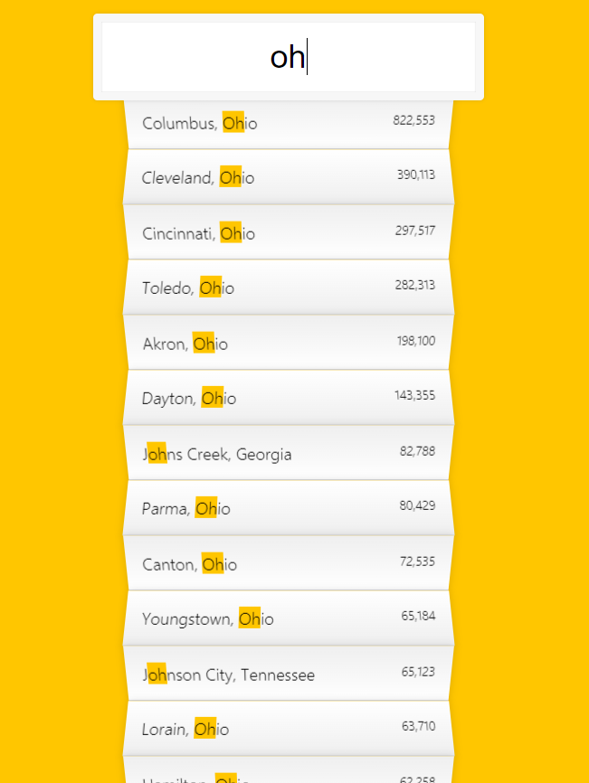

# Type Ahead

<br>




## 1. input form

```html
    <form class="search-form">
      <input type="text" class="search" placeholder="City or State" />
      <ul class="suggestions">
        <li>Filter for a city</li>
        <li>or a state</li>
      </ul>
    </form>
```

* form 태그로 검색창을 만듭니다.

* 자동완성을 구현할 것임.
* filter로 DB에 있는 모든 검색어 중 일치하는 prefix를 가진 모든 문자열을 나열.


## 2. cities DB

```js
const endpoint =     "https://gist.githubusercontent.com/Miserlou/c5cd8364bf9b2420bb29/raw/2bf258763cdddd704f8ffd3ea9a3e81d25e2c6f6/cities.json";

const cities = [];

fetch(endpoint)
  .then((blob) => blob.json())
  .then((data) => cities.push(...data));
```

fetch로 endpoint에 있는 data를 받아와 변환합니다. blob뭉치를 jon()으로 변환하고 그 결과값을 data인자로 받아 ...data(파이썬의 unpack과 유사)러 cities배열에 push 해줍니다.


### fetch

* 콜백함수 : 나중에 call하는 방법으로 순서를 지정해주는 비동기 처리.

* JavaSecipt, API, Markup을 근간으로 한 JAM stack.

* 과거처럼 서버단에서 API를 호출해주기 보다 Client에서 직접 API 호출하는 경우가 많아짐.

  > 브라우저에서 직접 비동기로HTTP통신을 하는 Ajax

* fetch 함수는 원격 API를 간편하게 호출할 수 있도록 브라우저 내장 함수.

* fetch이전에는 request, axios, jQuery 라이브러리. 

* node.js에서는 node-fetch나 unfetch 라이브러리.

* IE에서는 지원 안함.

<br>

#### 사용법

```js
fetch(url, options)
  .then((response) => console.log("response:", response))
  .catch((error) => console.log("error:", error));
```

* url과 options를 인자로 받음.
* options 객체 : HTTP method, headers, body 설정
* 성고하면 respose 객체로 부터 HTTP status, headers, body를 읽어올 수 있음.
* 반환하는 response 객체는 Promisse 타입의 객체임.

<br>

#### Promise

* 자바스크립트에서 비동기 처리를 위해 굉범위하게 사용됨.

* 당장 원하는 데이터를 얻을 수 없다는 것은 데이터를 얻는데까지 지연 시간(delay, latency)이 발생하는 경우. 
* I/O나 Network를 통해서 데이터를 얻는 경우가 대표적, CPU에 의해서 실행되는 코드 입장에서는 엄청나게 긴 지연 시간으로 여겨지기 때문에 Non-blocking 코드를 지향하는 자바스크립트에서는 비동기 처리가 필수적.
* Promise 객체의 `then()` 메소드는 결과값을 가지고 수행할 로직을 담은 콜백 함수를 인자로 받습니다. 그리고 `catch()` 메서드는 예외 처리 로직을 담은 콜백 함수를 인자로 받습니다.(동기의 try - cathch, 비동기의 then - catch)
* 사실 요새는 거의 async / await를 사용한다.

<br>

#### method chaining

* 리턴 받은 Promise 객체를 then을 통해 계속 접근할 수 있음.

* ```js
  .then((response) => response.json()) //을 통해 json형태로 출력하게 바꿈
  // 원래는 response: Response {type: "cors", url: "https://jsonplaceholder.typicode.com/posts/1", redirected: false, status: 200, ok: true, …} 이런 상태.
  
  // {
    "userId": 1,
    "id": 1,
    "title": "sunt aut facere repellat provident occaecati excepturi optio reprehenderit",
    "body": "quia et suscipit↵suscipit recusandae consequuntur …strum rerum est autem sunt rem eveniet architecto"
  // } 로 변환.
  ```

```js
fetch("https://jsonplaceholder.typicode.com/posts/1")
  .then((response) => response.json())
  .then((post) => post.userId)
  .then((userId) => "https://jsonplaceholder.typicode.com/users/" + userId)
  .then((url) => fetch(url))
  .then((response) => response.json())
  .then((user) => console.log("user:", user))
  .catch((error) => console.log("error:", error));
```

* 위 코드는 API에서 특정 정보(userId)만 가져와 새 url을 만들고 정보를 가져오는 콜백 함수들.


#### GET / POST / PUT / DELETE

* get은 요청전문필요 없기때문에 그냥 fetch, then으로 response받으면 됨.
* POST와 PUT은 위에서 말한 fetch의 두번째 인자인 options에 필요인자를 주면 됨. 
* delete는 보낼 데이터가 없기 때문에, headers와 body 옵션이 필요없음.(method만 첨부)

```js
fetch("https://jsonplaceholder.typicode.com/posts", {
  method: "POST",
  headers: {
    "Content-Type": "application/json",
  },
  body: JSON.stringify({
    title: "Test",
    body: "I am testing!",
    userId: 1,
  }),
})
  .then((response) => response.json())
  .then((data) => console.log(data));
```


#### async await 모듈화

```js
async function post(host, path, body, headers = {}) {
  const url = `https://${host}/${path}`;
  const options = {
    method: "POST",
    headers: {
      "Content-Type": "application/json",
      ...headers,
    },
    body: JSON.stringify(body),
  };
  const res = await fetch(url, options);
  const data = await res.json();
  if (res.ok) {
    return data;
  } else {
    throw Error(data);
  }
}

post("jsonplaceholder.typicode.com", "posts", {
  title: "Test",
  body: "I am testing!",
  userId: 1,
})
  .then((data) => console.log(data))
  .catch((error) => console.log(error));
```

* Promise는 then으로 획일화 되어있어서 오류 발생시 몇번째 then인지 Stack trrace를 봐도 디버깅하기 어려움.
* function 함수 앞에 async, Promise를 리턴하는 모든 비동기 함수 호출부 앞엔 await를 추가.
* await는 async 키워드 함수 내부에서만 기용가능하고 일반적 비동기처럼 바로 다음 라인으로 넘어간느게 아니라 결과값을 얻을때까지 기다려준다. 때문에 일반적인 동기코드와 동일한 흐름으로(변수에 할당하는 식으로) 코드를 작성할 수 있다.
* 동기 비동기 구분없이 try - catch문으로 일관된 예외처리가 가능한 것도 async await의 장점.

<br>

## 3. events

```js
const searchInput = document.querySelector(".search");
const suggestions = document.querySelector(".suggestions");

searchInput.addEventListener("change", displayMatches);
searchInput.addEventListener("keyup", displayMatches);
```

* search클래스를 가진 input box가 변하거나 key가 눌릴때마다 displayMatches를 불러옵니다.
* keyup은 키보드를 이용한 입력만 감지함.
  - (마우스 클릭으로 붙혀넣기하거나 자동완성 단어를 클릭해서 입력되는 이벤트 인식x)
* change는 외부를 눌렀을때만 인지함.
  - 키보드 단어 하나하나 누를때마다의 변화를 인지못함. 외부로 커서를 옮겨야 인식한다.
* 두 가지 모두써야 마우스 클릭으로 자동완성하는 경우도 검색을 할수있고 기존 자동완성의 목적인 방지할 수 있음.


## 4. displayMatch

```js
      function displayMatches() {
        // console.log(this.value);
        const matchArray = findMatches(this.value, cities);
        // console.log(matchArray);
        const html = matchArray
          .map((place) => {
            // 정규식에서 gi(gi는 패턴을 만들때 부여하는 옵션)와 일치하는 값을 
            // (g는 검색된 모든 결과, i는 대소문자 구분 x )
            const regex = new RegExp(this.value, "gi");
            // hl를 덧씌운 value값으로 대체한다.
            const cityName = place.city.replace(
              regex,
              `<span class="hl">${this.value}</span>`
            );
            const stateName = place.state.replace(
              regex,
              `<span class="hl">${this.value}</span>`
            );
            return `
            <li>
              <span class="name">${cityName}, ${stateName}</span>
              <span class="population">${numberWithCommas(
                place.population
              )}</span>
            </li>
          `;
          })
          .join("");
        suggestions.innerHTML = html;
      }
```

* findMatch로 받아온 매치된 문자열 배열에서 정규식을 통해 검색값과 일치하는 값을 span class hl이 들어간 태그로 변경시킵니다(강조를 위해)


#### RegExp

```js
//정규표현식 리터럴 
var pattern = /a/ 
// 정규표현식 객체 생성자 
var pattern = new RegExp('a');
```


##### 추출exec, test, match

```js
// RegExp.exec() => 필요한 정보(문자)를 추출하는데 목적 
console.log(pattern.exec('abcdef')); // ["a"] 
// 실행결과는 문자열 a를 값으로 하는 배열을 리턴한다. 
console.log(pattern.exec('bcdefg')); // null 
// 인자 'bcdef'에는 a가 없기 때문에 null을 리턴한다. 

// RegExp.test() => 패턴이 있는지 없는지를 테스트하는데 목적 
// test는 인자 안에 패턴에 해당되는 문자열이 있으면 true, 없으면 false를 리턴한다. 
console.log(pattern.test('abcdef')); // true 
console.log(pattern.test('bcdefg')); // false

console.log('abcdef'.match(pattern)); // ["a"] 
console.log('bcdefg'.match(pattern)); // null
```


##### 변경

```js
var pattern = /a/; 
var str = "abcdef"; 
console.log(str.replace(pattern, 'A')); // Abcdef
```


> 여기서 사용된 'g' 나 'i' 를 수정자(Modifier) 라고 합니다.
>
> | Modifier | Expression                                                |
> | -------- | --------------------------------------------------------- |
> | g        | 모든 전역 (첫번째 일치하는 문자열을 찾아도 끝까지 찾는다) |
> | i        | 대소문자 구분 없이                                        |
> | m        | 멀티라인도 수행                                           |
> | u        | 패턴을 유니코드 코드 포인트의 나열로 취급                 |
> | y        | "stick" 검색을 수행, 지정된 인덱스로 문자열 검색          |

* suggestions(suggestions class를 가진 태그) 에 innerhtml을 통해 새로 만든 html return 값을 주입시킵니다.

<br>

## 5. findMatches

```js
      function findMatches(wordToMatch, cities) {
        // search된 것과 일치하는 것을 표시해야함.
        return cities.filter((place) => {
          const regex = new RegExp(wordToMatch, "gi");
          return place.city.match(regex) || place.state.match(regex);
        });
      }
      // fetch는 promise를 반환함.
	  // 숫자 1000단위로 , 구분자 넣기.	
      function numberWithCommas(x) {
        return x.toString().replace(/\B(?=(\d{3})+(?!\d))/g, ",");
      }
```

* 매칭시킬 패턴인 wordTomatch와 cities에서 일치하는 요소들을 filter해 리턴합니다.

* RegExp는 정규표현식 객체를 생성합니다.
  * ```js
    let re = /\w+/
    let re = new RegExp('\\w+')
    ```

    

