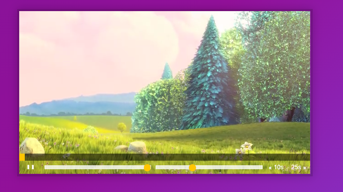

# 11 - Custom Video Player





# Mark-up

```html
   <div class="player">
     <video class="player__video viewer" src="652333414.mp4"></video>

     <div class="player__controls">
       <div class="progress">
        <div class="progress__filled"></div>
       </div>
       <button class="player__button toggle" title="Toggle Play">►</button>
       <input type="range" name="volume" class="player__slider" min="0" max="1" step="0.05" value="1">
       <input type="range" name="playbackRate" class="player__slider" min="0.5" max="2" step="0.1" value="1">
       <button data-skip="-10" class="player__button">« 10s</button>
       <button data-skip="25" class="player__button">25s »</button>
     </div>
   </div>
```

<br>

## elements

```js
const player = document.querySelector(".player");
const video = player.querySelector(".viewer");
const progress = player.querySelector(".progress");
const progressBar = player.querySelector(".progress__filled");
const toggle = player.querySelector(".toggle");
const skipButtons = player.querySelectorAll("[data-skip]");
const ranges = player.querySelectorAll(".player__slider");
```

<br>

## events

```js
video.addEventListener("click", togglePlay);
video.addEventListener("play", updateButton);
video.addEventListener("pause", updateButton);
video.addEventListener("timeupdate", handleProgress);

toggle.addEventListener("click", togglePlay);
skipButtons.forEach((button) => button.addEventListener("click", skip));
ranges.forEach((range) => range.addEventListener("change", handleRangeUpdate));
ranges.forEach((range) =>
  range.addEventListener("mousemove", handleRangeUpdate)
);

let mousedown = false;
progress.addEventListener("click", scrub);
progress.addEventListener("mousemove", (e) => mousedown && scrub(e));
progress.addEventListener("mousedown", () => (mousedown = true));
progress.addEventListener("mouseup", () => (mousedown = false));

```

* 실제 제어: click, mousemove, mousedown, mouseup
* 자동 제어: play, pause, timeupdate, change

<br>

## functions

```js
// vedio 태그의 play(), pause() 내장함수
function togglePlay() {
  const method = video.paused ? "play" : "pause";
  video[method]();
}

function updateButton() {
  const icon = this.paused ? "►" : "❚ ❚";
  console.log(icon);
  toggle.textContent = icon;
}
// video의 currentTime 속성을 조절. 클릭한 버튼의 dataset.skip속성을 부여한 값만큼.
function skip() {
  video.currentTime += parseFloat(this.dataset.skip);
}
// video의 range이름 속성 volume, playbackRate 를 조정
function handleRangeUpdate() {
  video[this.name] = this.value;
}
// progress bar를 채우는 값(flesBasis)의 %를 제어. 현 시간 / 총 시간.
// timeyupdate가 일어나면 발생.
function handleProgress() {
  const percent = (video.currentTime / video.duration) * 100;
  progressBar.style.flexBasis = `${percent}%`;
}
// progress의 (offesetX / 총 progress의 offset너비) * 시간.
function scrub(e) {
  const scrubTime = (e.offsetX / progress.offsetWidth) * video.duration;
  video.currentTime = scrubTime;
}
```


### element의 위치/ 크기

1. offsetWidth, offsetHeight : 화면을 봤을 떄 보여지는 요소의 폭(element.offsetWidth)
2. clinentWidth, clientHeight : border를 뺀 안쪽 폭
3. scrollWidth, scorllHeight : 화면에 보이지 않는 영역까지 계산한 스코롤 폭(document.body.scrollHeight)

4. scrollLeft, scrollTop : 스크롤 된 x, y값
5. getBoundingClientRect() : document에서 element의 left, top, right, bottom, width, height


### mouseEvent

1. clientx, clientY: document의 가장 위쪽부터 마우스 포인터 위치값.
2. offsetX, offsetY : 이벤트가 발생한 element내부의 마우스 포인터의 x, y값.


### video["play"], video["pause"]

```js
function playVid() {
    vid.play();
}

function pauseVid() {
    vid.pause();
}
```

