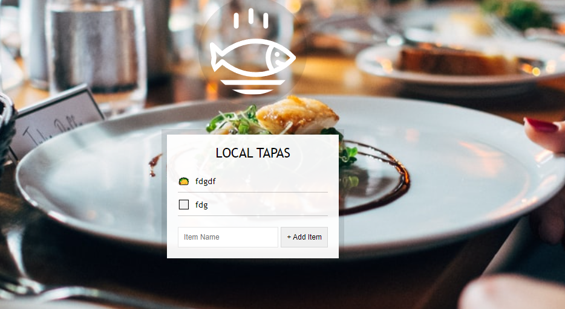

# Local Storage

* local storage
* 이벤트 위임.

<br>

## data는 늘 서버로 보내야 할까?

* 브라우저는 서버로 data를 보내면 해당 내용의 반환에 따라 rerendering된다.
* 하지만 중요도가 낮거나 유실되어도 될 데이터까지 DB에 저장해야할까?
* 브라우저는 이런 데이터를 client단에서 해결하기 위한 웹 스토리지를 제공한다.
* 웹 스토리지는 브라우저마다 제공하는 용량이 다르다.
* 같은 컴퓨터의 같은 브라우저에만 영속한다.

<br>

## Local Storage vs Session Storage

* 세션 스토리지는 웹 페이지의 세션이 끝날때 저장된 데이터가 지워지고
* 로컬 스토리지는 지워지지 않는다.
* 즉 동일 사이트를 여러 창에 띄우면 세션 스토리지에 격리되어 저장된다(로그인을 각각 따로)
* 하지만 로컬 스토리지에 담기는 데이터는 서로 공유되고 창을 닫아도 브라우저에 남아있다.

<br>

## 기본 API

* 주의할 점은 data를 다른 type으로 써도 문자형으로 저장되기때문에 조회도 문자로 해야한다.
* 이를 위해 JSON.stringify나 JSON.parse 등을 이용해 직렬화해 저장하고 역직렬화해 호출한다.
* 로컬 스토리지는 끈다고 날아가지 않으므로 clear를 통해 청소해주는 것이 좋다.

```js
// 키에 데이터 쓰기
localStorage.setItem("key", value);

// 키로 부터 데이터 읽기
localStorage.getItem("key");

// 키의 데이터 삭제
localStorage.removeItem("key");

// 모든 키의 데이터 삭제
localStorage.clear();

// 저장된 키/값 쌍의 개수
localStorage.length;
```




<br>

<br>

## form

* to-do list를 작성해 보낼 form

```html
    <div class="wrapper">
      <h2>LOCAL TAPAS</h2>
      <p></p>
      <ul class="plates">
        <li>Loading Tapas...</li>
      </ul>
      <form class="add-items">
        <input type="text" name="item" placeholder="Item Name" required />
        <input type="submit" value="+ Add Item" />
      </form>
    </div>
```

<br>

<br>

## DOM

* 각 Markup에 대응할 객체

```js
      const addItems = document.querySelector(".add-items");
      const itemsList = document.querySelector(".plates");
      const items = JSON.parse(localStorage.getItem("items")) || [];
```

<br>

<br>

## AddItem

* form의 submit event마다 리렌더링을 막고 localstorage를 갱신시켜줌(items)

```js
      function addItem(e) {
        // 제출 누를때마다 페이지 새로 랜더링(리로드)되는 것 막음. (외부나 서버에 데이터를 보낼땐 자동)
        // 우리는 client 단에서 끝낼 것 이므로 막아줌.
        e.preventDefault();
        const text = this.querySelector("[name=item]").value;
        const item = {
          text,
          done: false
        };
        // console.log(item);
        items.push(item);
        populateList(items, itemsList);
        localStorage.setItem("items", JSON.stringify(items));
        this.reset();
      }
```

<br>

<br>

## populateList

* items배열의 내용을 itemsList의 HTML에 담을 함수

```js
      // 목록에 HMTL 채워서 반환하기
      function populateList(plates = [], platesList) {
        platesList.innerHTML = plates
          .map((plate, i) => {
            return `
            <li>
              <input type="checkbox" data-index=${i} id="item${i}" ${
              plate.done ? "checked" : ""
            }/>
              <label for="item${i}">${plate.text}</label>  
            </li>
          `;
          })
          .join("");
      }
```

<br>

<br>

## toggleDone

* checkbox click 이벤트 마다 items내 item의 done속성을 toggle하고 localstorage에 setItem

```js
      function toggleDone(e) {
        if (!e.target.matches("input")) return;
        const el = e.target;
        const index = el.dataset.index;
        items[index].done = !items[index].done;
        localStorage.setItem("items", JSON.stringify(items));
        populateList(items, itemsList);
      }
```

<br>

<br>

## eventListener

```js
      addItems.addEventListener("submit", addItem);
      itemsList.addEventListener("click", toggleDone);

      populateList(items, itemsList);
```

