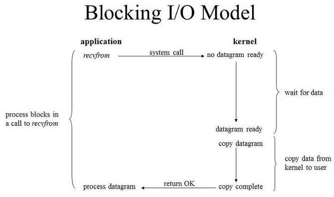
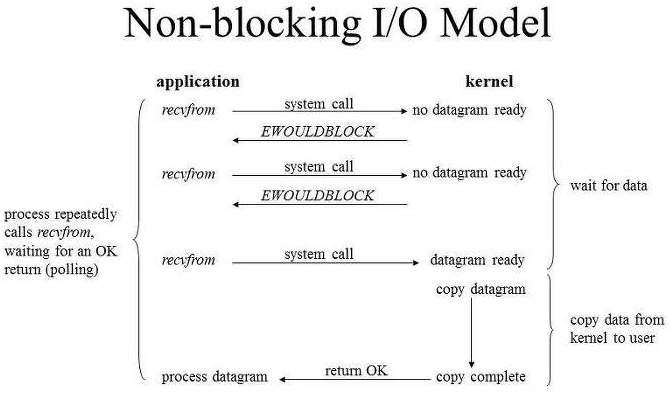

## Blocking I/O & Non-Blocking I/O

> I/O 작업 : 유저 레벨에서 수행 X, Kernel Level에서 수행
>
> Process, Thread : Kernel에 I/O 요청

### Blocking I/O

- User Process가 Kernel에 I/O 요청 함수 호출 -> Kernel 작업 완료 시 함수가 작업 결과 반환
- I/O 작업 진행 중 : User Process 작업 중단, 대기 -> CPU 작업 거의 쓰지 않아서 리소스 낭비

### Non-Blocking I/O

- Blocking 비효율성 극복
- I/O 작업 진행 중 : User Process 작업 중단 X
- User Process가 Kernel에 I/O 요청 함수 호출 -> 함수 : I/O 요청 후 진행 상황과 상관 없이 바로 결과 반환

