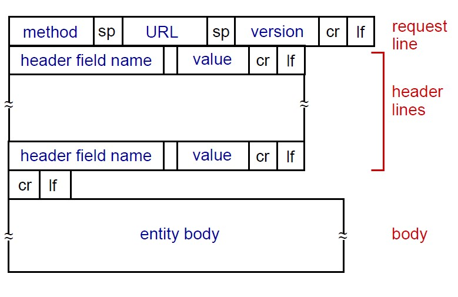
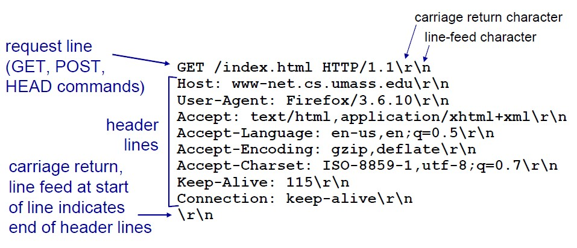
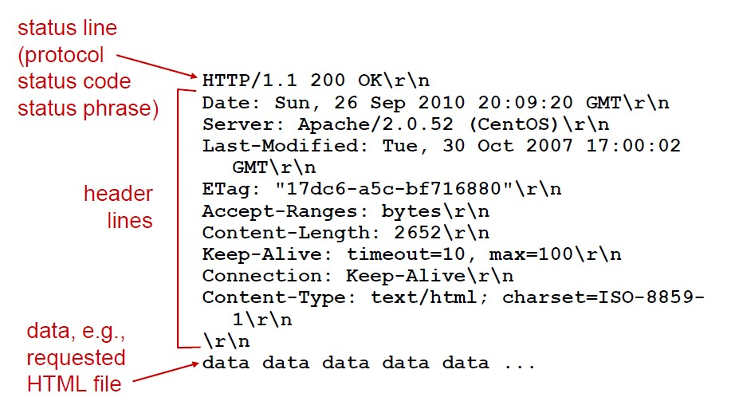

# **HTTP & HTTPS**

### 1. **HTTP란**

HypterText Transport Protocol

웹 상에서 데이터를 주고받기 위한 통신 프로토콜, URL을 사용

ex) http://www.google.com/search?q=hello

cf) DNS (Domain Name System)

- host name: http://www.google.com
- path name: search?q=hello

클라이언트/서버 모델

### 2. **HTTP의 특징**

#### 2-1. **TCP connection (HTTP/3 이전 프로토콜)**

#### 2-2. **Stateless**

서버가 클라이언트의 상태를 보존하지 않음

장점? 클라이언트 요청이 증가했을 때 서버를 대거 투입할 수 있다. 응답 서버를 쉽게 바꿀 수 있기 때문

↔ stateful, 항상 같은 서버가 유지되야 함

cf) 로그인과 같은 상태 유지는 쿠키, 서버 세션을 이용함 (상태 유지는 최소한으로 사용)

#### 2-3. **Connectionless**

- non-persistent HTTP

  하나의 object, 한 번의 TCP connection, 이후에 연결 끊음

- persistent HTTP

  TCP connection이 일정시간 유지됨, 여러 object들을 보낼 수 있음.

### 3. HTTP message

- Request message

  

  

- Response message

  

  - response status codes

  ​	**200 OK** : request succeeded

  ​	**301 Moved Permanetly** : request object moved

  ​	**400 Bad Request** : 서버가 request 메시지를 이해하지 못함

  ​	**404 Not Found** 

  ​	**505 HTTP Version Not Supported**

### 4. **프로토콜 버전**

#### **HTTP/1.0**

GET, POST, HEAD

(HEAD: GET과 같은 기능, 메시지 바디는 돌려주지 않음)

non-persistent HTTP

#### **HTTP/1.1**

GET, POST, HEAD, PUT, DELETE

(PUT : 파일 전송)

persistent HTTP

#### **HTTP/2**

바이너리 프레이밍(Binary Framing) 계층 사용 -> 파싱, 전송속도 높임

리소스간 우선 순위 설정 가능

중복된 헤더의 크기 감소(압축)

#### **HTTP/3**

QUIC

UDP 사용

### 5. **Cookies**

### 6. **Web caches (proxy server)**

### 7. **HTTP의 약점**

#### 7-1. **도청가능**

네트워크 상을 흐르고 있는 패킷을 수집하는 것으로도 도청 가능

→  통신 암호화 : SSL, TLS

SSL : Secure Socket Layer

TLS : Transport Layer Security

→  콘텐츠 암호화 : http 메시지 바디를 암호화

#### 7-2. **위장 가능**

서버가 클라이언트가 누구인지 확인하지 않는다

SSL로 상대 확인 가능, 증명서 제공 기능도 함

증명서: 신뢰할 수 있는 제3자 기관에 의해 발행, 서버나 클라이언트가 실재한다는 것을 증명

#### 7-3. **변조 가능**

정보의 정확성을 증명할 수가 없음. 즉, 정보가 정확한지 아닌지 확인 불가

수신 도중 변조의 가능성 (Man-in-the-Middle 공격)

MD5, SHA-1 등의 해시 값 확인 / 디지털 서명 확인 => 완벽한 방법은 아님

#### **결론**

HTTP + 암호화 + 인증 + 완전성 보호 = HTTPS(HTTP Secure)

#### **공개키 암호화 방식 (SSL에서 사용)**

키를 비밀로

암호화, 복호화에 하나의 키 사용: 공통키 암호

→  상대방에게 키를 넘겨주는 과정에서 키를 빼앗기는 문제가 있을 수 있다.

이를 보완하는 방법이 공개키 암호

서로 다른 두 개의 페어를 사용

한쪽은  비밀키(private key)  한쪽은 공개키(public key)

암호를 보내는 측이 상대의 공개키를 이용해 암호화, 암호화된 정보를 받아들인 상대는 자신의 비밀키를 이용해 복호화

- HTTPS는 하이브리드 암호 시스템

  공개키 암호는 공통기 암호보다 처리가 느려서 상황에 맞게 사용

- 공개키가 정확한지 증명하는 증명서

  공개키가 진짜인지 알 수 없다는 문제점

  인증 기관, CA(Certificate Authority)와 그 기관이 발행하는 공개키 증명서를 이용

  인증 기관이란 클라이언트, 서버가 모두 신뢰하는 제3자 기관 (ex. VeriSign)

  

#### 인증기관(CA) 이용

인증기관의 공개키는 브라우저에 내장되어 있음.

1. 서버의 공개키를 인증 기관에 등록
2. 인증 기관의 비밀키로 서버의 공개키에 디지털 서명으로 공개키 증명서를 작성 등록
3. 서버의 공개키 증명서를 입수하고, 디지털 서명을 인증 기관의 공개키로 검증
4. 서버의 공개키로 암호화해서 메시지를 송신 기관에 등록

