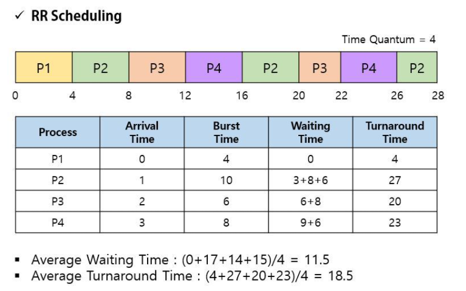
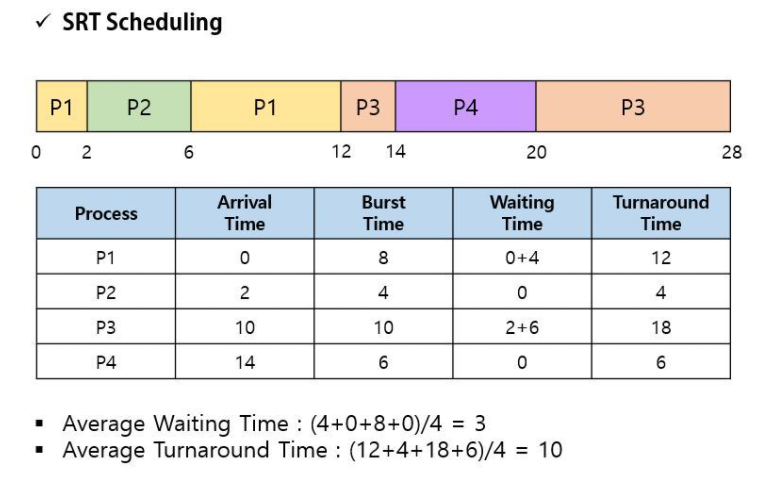
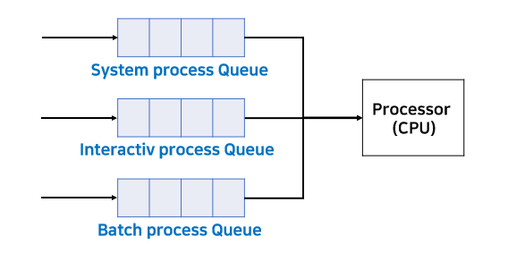

## CPU Scheduling

### CPU 스케줄링 이란?

CPU가 하나의 작업(프로세스)가 끝나면 다음 작업을 수행해야 하는데 이 때, 어떤 프로세스를 처리할지 선택하는 것. 효율적 프로세스 배정 중요

- 선점형(Preemptive) 스케줄링 방식
  - 프로세스가 CPU를 점유하는 동안 다른 프로세스가 CPU를 강제로 점유하여 실행 가능
- 비선점형(Non-Preemptive) 스케줄링 방식
  - 프로세스가 CPU 점유 중에 I/O나 인터럽트 같은 간섭이나 프로세스 종료까지 다른 프로세스가 CPU를 점유하지 못함

### 선점형 스케줄링

* 장점 : 우선순위가 높은 프로세스를 빠르게 처리할 수 있다.
* 단점 : 오버헤드가 크며(우선도가 높은 프로세스들이 들어오는 경우), 처리시간 예측이 어려움

#### 예시

##### 라운드 로빈(Round Robin, RR)

* 프로세스마다 같은 크기의 CPU 시간을 할당하는 방식

* 이 시간내에 프로세스 처리를 완료 못한다면 큐의 가장 뒤로 보내지고 CPU는 다음 프로세스를 실행
* 모든 프로세스에 균등한 CPU점유시간을 보장하며, 시분할 시스템을 사용한다
  * 시분할 시스템 : CPU 스케줄링과 다중 프로그래밍을 이용해서 각 사용자들에게 컴퓨터 자원을 시간적으로 분할하여 사용할 수 있게 해주는 대화식 시스템

##### SRT(Shortest Remaining Time First)

* 실행시간이 짧은 순서대로 프로세스를 수행하는 방식
* 현재 실행중인 프로세스의 남은 실행시간보다 실행시간이 짧은 프로세스가 큐에 들어오면 더 짧은 프로세스가 CPU를 선점한다.

##### 다단계 큐(Multi Level Queue)

* 프로세스들을 그룹으로 나누어 각 그룹마다 Ready Queue를 여러개 두며, 각 큐마다 다른 규칙을 지정이 가능하다.
* 여러개의 큐를 이용해서 상위단계 작업이 선점되는 방식

##### 다단계 피드백 큐(Multi Level Feedback Queue)

* 큐마다 서로 다른 CPU시간 할당량을 부여
* 다단계 큐와 유사한 방식이지만 프로세스가 큐에서 다른 큐로 이동이 가능하다는 차이
* 모든 큐는 가장 위의 큐에서 대기를 시작하며 대기시간이 매우 길어질 경우 아래에 있는 큐로 이동하는 방식으로 대기시간을 조정
* 큐에서 프로세스가 실행되는 순서는 각 큐마다 FCFS방식으로 먼저 들어온 순서대로 실행
* 유연성이 뛰어나고 turnaround시간과 response time에 최적화된 알고리즘

### 비선점형 스케줄링

* 한 프로세스가 CPU를 할당받았을 시 작업 종료까지 다른 프로세스는 CPU 점유가 불가능
* 모든 프로세스에 대한 요구를 공정하게 처리할 수 있지만, 작업시간이 짧은 프로세스가 긴 시간을 대기해야하는 콘베이 현상이 발생 가능

##### FCFS(First Come First Server) 

* First In First Out
* 큐에 먼저 도착한 프로세스가 먼저 CPU를 점유하는 방식
* 실행시간이 긴 프로세스가 먼저 들어올경우 다소 비효율적

##### SJF(Shortest-Job-First)

* 현재 대기중인 프로세스중 실행시간이 짧은 순서대로 CPU를 먼저 할당
* 선점, 비선점방식 모두 가능
* 프로세스의 웨이팅이 가장 적은 가장 효율적인 스케줄링 방법이지만 현실에선 실제 CPU 점유시간을 알 수 없기 때문에 비현실적

##### Priority

* 우선순위가 높은 순서대로 실행되는 스케줄링 방식
* 우선순위는 정수값으로 주어지며 Unix/Linux기준 작은값이 우선순위가 높음
* 마찬가지로 선점, 비선점방식 모두 가능
* 우선순위가 낮은 큐가 오래도록 기다릴 수 있는 단점 
  * ready queue에 일정 시간 이상 대기 중인 프로세스의 우선순위를 높여주는 aging 방식으로 해결

