# 메모리관리

* 메모리접근, 주소 변환에서 운영체제의 역할은 하나도 없음 전부 하드웨어의 영역. 
* 운영체제는 I / O 접근만 관여함.

## 주소

### 논리 주소(Logical Address = virtual address)

* 프로세스마다 독립적으로 가지는 주소 공간
* 각 프로세스마다 0번지부터 시작
* CPU가 보는 주소는 logical address임

### 물리 주소(Physical address)

* 메모리에 실제 올라가는 위치

> 주소 바인딩 : 주소를 결정하는 것.
>
> Symbolic Address -> Logical Address -> Physical Address
>
> Symbolic (함수 명 등 숫자가 아닌 위치) -> 컴파일을 통해 논리주소(숫자) -> 실행은 물리 주소

---

### 주소 바인딩(Address Binding)

* 논리 주소가 물리 메모리에 저장되는 것

#### Compile time binding

* 물리적 메모리 주소(Physical address)가 컴파일 시 알려짐
* 시작 위치 변경 시(수정 시) 재컴파일
* 컴파일러는 절대 코드(absolute code) 생성

#### Load time binding

* Loader의 책임하에 물리적 메모리 주소 부여
* 컴파일러가 재배치가능코드(relocatable code)를 생성한 경우 가능
* 실행시 바인딩

#### Excution time binding (=Run time binding)

* 수행이 시작된 이후에도 프로세스의 메모리 상 위치를 옮길 수 있음. 
* CPU가 주소를 참조할 때마다 binding을 점검 (address mapping table)
* 하드웨어적인 지원 필요 (base and limit registers, MMU)
* 실행도중 바뀔 수 있음.

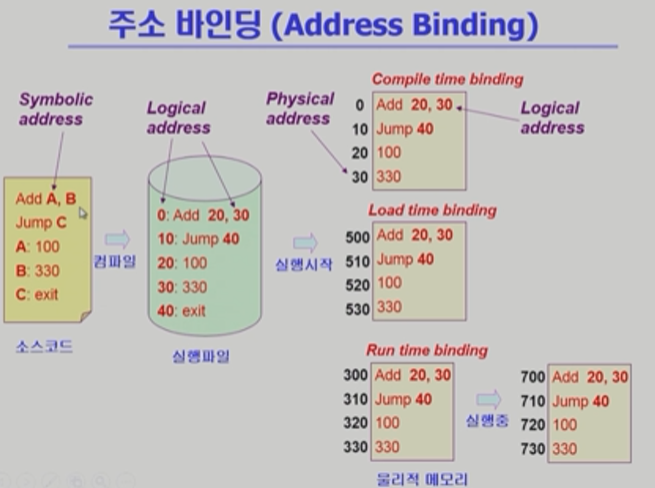

* Logical address : xx번지

 

---

 

## MMU (Memory Management Unit)

* Logical Address를 Physical Address로 mapping해주는 하드웨어

### MMU scheme

* 사용자 프로세스가 CPU에서 수행되며 생성해내는 모든 주소값에 대해 base register (relocation register)의 값을 더한다.

### user program

* logical address만을 다룬다
* 실제 physical address를 볼 수 없으며 알 필요 없다.

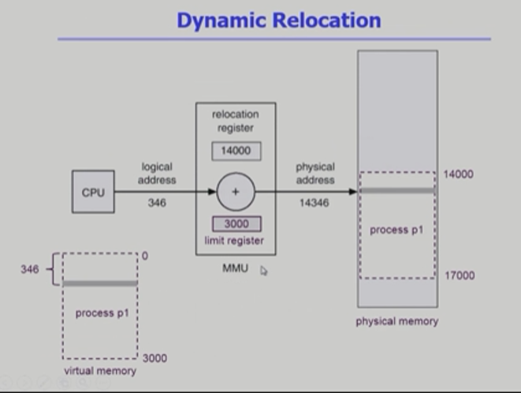

* 2개의 regiser로 주소 변환

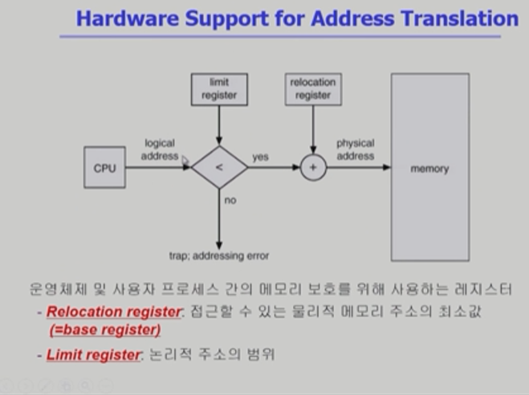

* 프로그램이 자신에게 할당 된 Limit register에 불가능한 address 요청하면 trap이 걸려 하던일을 멈추고 CPU 제어권이 운영체제로 넘어감.
* OS는 악의적인 요청에대해 프로그램을 강제종료 시키며 응징
* 바른 범위에 있는 주소를 요청했다면 주소변환 후 물리 메모리에서 읽어옴

---

 

## Dynamic Loading (프로그램을 동적으로 메모리에 올림)

* 프로세스 전체를 메모리에 미리 다 올리는 것이 아니라 해당 루틴이 불려질 때 메모리에 load하는 것.
* memory utilization의 향상
* 가끔씩 사용되는 많은 양의 코드의 경우 유용(오류 처리 루틴 같은)
* 운영체제의 특별한 지원 없이 프로그램 자체에서 구현 가능 (OS는 라이브러리를 통해 지원 가능)
* 프로그래머가 직접 구현 ( 운영체제가 자체적으로 하는 페이징과 다름)

 

## Overlays

* 메모리에 프로세스의 부분 중 실제 필요한 정보만을 올림
* 프로세스의 크기가 메모리보다 클 때 유용
* 운영체제의 지원없이 사용자에 의해 구현
* 작은 공간의 메모리를 사용하던 초창기 시스템에서 수작업으로 프로그래머가 구현(=Manual Overlay), 프로그래밍이 매우 복잡

> 운영체제 지원 유무가 Dynamic Loading과 Overlay의 차이

 

## Swapping

* 프로세스를 일시적으로 메모리에서 backing store로 쫓아내는 것
* backing store(swap area): 디스크.(충분히 빠르고 큰 저장 공간)

* Swap in / out
  * 일반적으로 중기 스케줄러(swapper)에 의해 swap out 시킬 프로세스 선정
  * priority-based CPU scheduling algorithm
    * priority가 낮은 프로세스 swap out
    * priority 높은 프로세스 메모리에 올려놓음
  * compile time 혹은 load time binding에서는 원래 메모리 위치로 swap in 해야함
  * Excution time binging에서는 추후 빈 메모리 영역 아무 곳에나 올릴 수 있음
  * swap time은 대부분 transfer time(크기에 비례하는 시간)
  * 크기가 작으면 seek time이 더 큼(탐색)

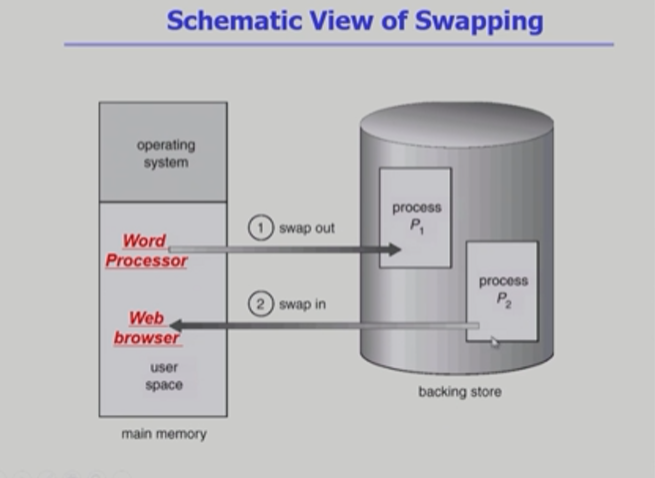

## Dynamic Linking

* Linking을 실행 시간 (execution time)까지 미루는 기법

### Static Linking

* 라이브러리가 프로그램의 실행 파일 코드에 포함됨
* 실행 파일의 크기가 커짐.
* 동일한 라이브러리를 각각의 프로세스가 메모리에 올리므로 메모리 낭비
* ex. printf 함수의 라이브러리 코드

### Dynamic Linking

* 라이브러리가 실행 시 연결(link)됨
* 라이브러리 호출 부분에 라이브러리 루틴의 위치를 찾기 위한 stub이라는 작은 코드를 둠
* 라이브러리가 이미 메모리에 있으면 그 루틴의 주소로 가고 없으면 디스크에서 읽어옴 (이미 올라와있으면 공유함 - shared 라이브러리)
* 운영체제의 도움이 필요.

---

 

## Allocation of Physical Memory

### 메모리는 일반적으로 두 영역으로 나뉘어 사용

* OS 상주 영역 : interrupt vector와 함께 낮은 주소 영역 사용
* 사용자 프로세스 영역 : 높은 주소 영역 사용

### 사용자 프로세스 영역의 할당 방법

* Contiguous allocation : 각각 프로세스가 메모리의 연속적인 공간에 적재

  Fixed partition allocation, Variable partition allocation

* NonContiguous allocation : 하나의 프로세스가 메모리 여러 영역에 분산

  Paging, Segmentaion, Paged Segmentation

---

### Contiguous Allocation

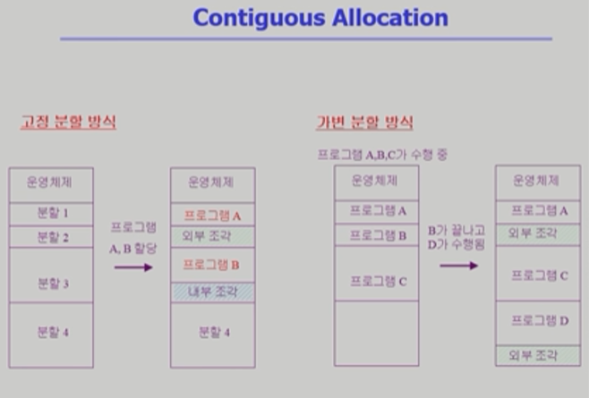

#### 고정 분할 방식

* 물리 메모리를 몇 개의 영구적 분할(partition)으로 나눔
* 분할의 크기가 모두 동일한 방식과 서로 다른 방식이 존대
* 분할당 하나의 프로그램 적재
* 융통성이 없음
  * 동시에 메모리에 load되는 프로그램 수 고정
  * 최대 수행 가능 프로그램 크기 제한
* 외부, 내부조각 발생

#### 가변 분할 방식

* 프로그램의 크기를 고려해서 할당
* 분할의 크기, 개수가 동적으로 변함 (프로그램 시작, 종료마다)
* 기술적 관리 기법 필요
* 외부조각 발생

##### 외부 조각 (Externel Fragmentation)

프로세스가 종료 되고 빠져나간 곳에 hole이 생기는 현상

##### 내부 조각 (Internal Fragmentation)

파티션보다 프로그램이 작을 떄 남는 부분인 내부 조각이 됨.

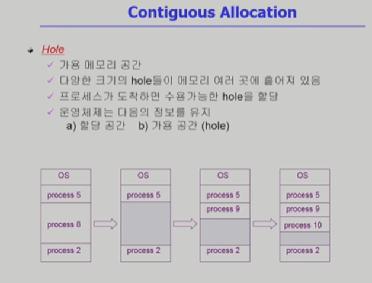

---

### Dynamic Storage-Allocation Problem

* 가변 분할 방식에서 size n인 요청을 만족하는 가장 적절한 hole을 찾아보자!

#### First-fit

size가 n 이상인 것 중 최초의 hole

#### Best-fit

size가 n 이상인 것 중 가장 작은 hole, 크기순 정렬이 아니기에 모든 리스트 탐색, 더 작은 hole이 많이 생성 됨.

#### Worst-fit

가장 큰 hole, 모든 리스트 탐색, 큰 hole들이 계속 생성.

> First, Best가 Worst보다 속도, 공간적으로 효율적

#### Compoaction

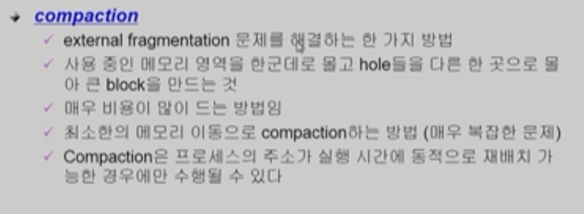

* 외부조각을 없애고 한 곳에 몰아넣어 hole을 없애는..
* Runtime binding이 지원되야 가능.
* 조각모음같은 것.
* 다 움직이는 건 너무 비용이 큼. 어떤 영역을 이동시킬 것인가에 대한 선택.

---

### Noncontiguous Allocation

* Paging은 균일한 단위
* Segmentaion은 의미있는 단위 (함수 단위? 어떤 단위?) - 균일 x

#### Paging

* Process의 virtual memory를 동일한 사이즈의 page로 나눔
* Virtual memory의 내용이 page 단위로 불연속하게 저장된
* 일부는 backing storage에 일부는 물리 memery에 저장.

##### Basic Method

* Physical memory를 동일한 frame으로 나눔
* logical memory를 동일한 page로 나눔(frame==page 크기)
* 모든 가용 frame을 관리
* page table을 사용해 논리주소를 물리주소로 변환(mmu만으론 불가)
* 외부 단편 x, 내부 단편 o
* 일종의 배열 형태

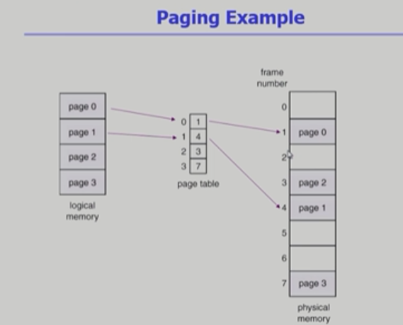

* table = 배열 : 인덱스 이용 바로 접근

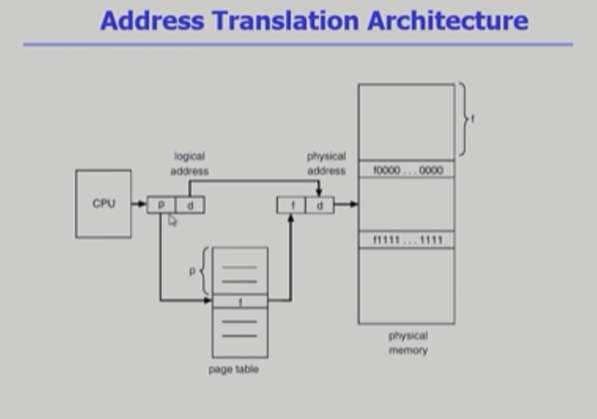

* p가 f로 바뀜.
* d는 offset으로 내부에서 위치를 뜻함(안바뀜)

#### Page table

* page table은 main memory에 상주
* mmu의 두개의 register가 paging에서는 아래용도로 쓰임
* page-table base register(PTBR)가 page table을 가리킴
* page-table length register(PTLR)가 테이블 크기를 보관
* 모든 메모리 접근 연산에는 2번의 memory access 필요
* page table 접근 1번, 실제 data/instruction 접근 1번 (p, d)
* 속도 향상을 위해  associative register 혹은 translation look-aside buffer(TLB) 라 불리는 고속의 lookup hardware cache 사용

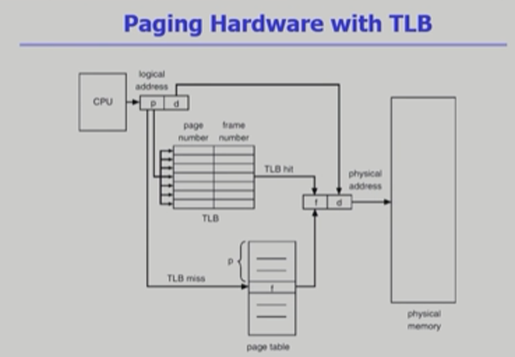

* 메모리 주소변환을 위한 cache memory.
* 메인 메모리보다 접근이 빠른 하드웨어로 구성됨
* 다 담지는 못하고 빈번히 사용되는 주소만을 보관.
* TLB miss되면 page table로 돌아감.

##### Associative Register(TLB 구현)

* parellel search 가능 (여러줄을 동시에 읽음)
* 주소 변환
  * page table의 일부가 Associative Register에 보관
  * 만약 해당 page #가 Associative Registerd에 있는 경우 곧바로 frame #을 얻음
  * 없으면 page table로 부터 frame #을 얻음.
  * TLB는 context switch 때 flush(remove old entries)를 시켜서 모든 메모리를 비워줘야함(주소가 바뀌기 때문에)

##### Effective Access Time

> Associative register lookup time = e
>
> memory cycle time (메모리 접근 시간 O(1) ) = 1
>
> Hit reatio (associative register에서 찾아지는 비율)= a
>
> Effective Access Time(EAT) = (1+e)a + (2 + e)(1 - a) = 2 + e - a
>
> - hit + miss속도 기댓값

 

---

#### Two-Level Page Table

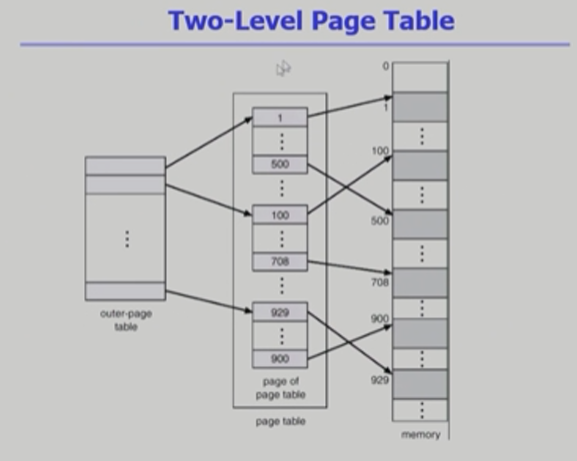

* 속도는 줄어들지 않으나 공간은 줄일 수 있다.
* 2^10 Kilo, 2^20 Mega, 2^30 Giga
* 32 bit 주소체계는 2^32 (4G), page size가 4K면 1M개의 page table entry 필요.
* 각 page table entry가 4B면 프로세스당 4M의 page table이 필요해져버림.
* page table 낭비가 심하기 때문에 page table로 page로 구성
* 사용되지 않는 주소 공간에 대한 outer page table의 entry값은 null (대응 inner page table 안만듦)
* null이 아니면 굳이 2중으로 만들 필요가 없음. (실제로 상당부분 사용이 안되기 때문에 효율적임)

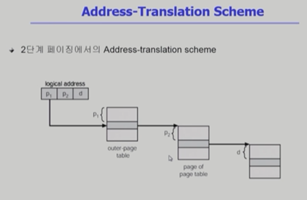

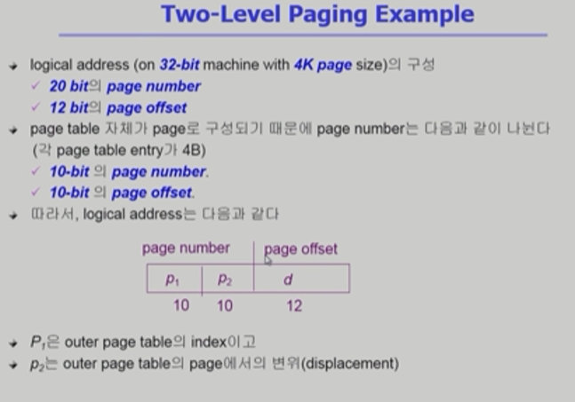

* 비낕쪽, 안쪽, offset
* page 크기는 4K이기 때문에 offset 주소 표시에  2^12 Byte이므로 12 bit가 필요.
* 1K개의 entry위치를 구분 하기 위해서 2^10이 필요하기 떄문에 page entry는 10 bit씩 영역을 가져감
* P1은 p2외 d를 뺀 나머지

#### Multilevel Pageing and Performance

* Address space가 더 커지면 다단계 페이지 테이블 필요
* 각 단계의 페이지 테이블이 메모리에 존재하므로 logical address의 physical address 변환에 더 많은 메모리 접근 필요
* TLB를 통해 메모리 접근 시간을 줄일 수 있음
* 4단계 페이지 테이블을 사용하는 경우
  * 메모리 접근 시간이 100ns, TLB 접근 시간이 20ns이고 TLB hit ratio가 98%인 경우
  * effective memory access time = 128 ns
  * 결과적으로 주소 변환을 위해 28ns만 소요하게 됨

#### Valid / Invalid , Protection bit

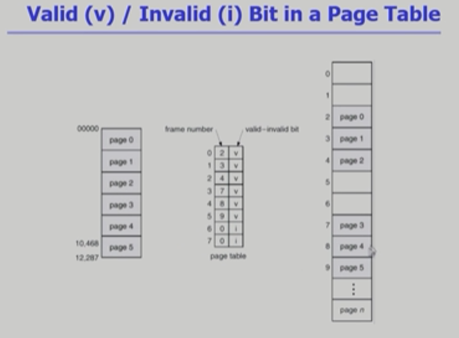

* page table에는 주소 정보 뿐만 아니라 v, i. bit도 가지고 있음.
* valid는 해당 주소의 frame에 그 프로세스를 구성하는 유효한 내용이 있음 (접근 허용)
* invalid는 해당 frame에 유효한 내용이 없음.(접근 불허)
  * =프로세스가 사용하지 않는 부분
  * =해당 페이지가 메모리가 아닌 swap area에 있는 경우
* Protection bit 는 page에 대한 접근 권한(read/write/read-only)

---

#### Inverted Page Table

##### Page table이 매우 큰 이유

* 모든 process 별로 그 logical address에 대응하는 모든 page에 대해 page table entry가 존재
* 대응하는 page가 메모리에 있든 아니든 간에 page table에는 entry로 존재

##### Inverted page table

* Page frame 하나당 page table에 하나의 entry를 둔 것(system-wide)
* 각 page table entry는 각각의 물리적 메모리의 page frame이 담고 있는 내용을 표시(process-id, process의 logical address)
* 단점 : 전체 테이블을 탐색해야함(바로 접근 x)
* 조치 : 별도의 하드웨어인 associative register 사용 (비쌈)해 병렬적으로 읽음.

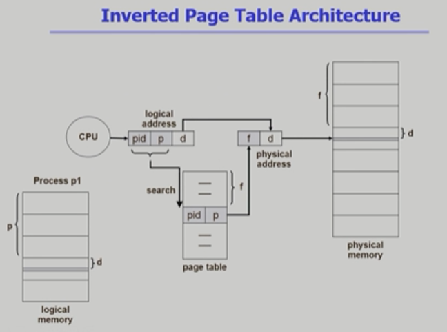

* 기존에 프로세스마다 존재하던 page table. inverted page table는 page table은 하나. 물리 주소영역의 frame만큼의 table 하나.

* 공간은 많이 줄어드나 시간이 많이 소요.
* pid = process id

#### Shared Pages

* 같은 코드는 여러 프로세스에서 공유. (코드를 공유!!)
* Re-entrant code(Pure code) 재진입가능 코드
* read-only로 하여 프로세스 간에 하나의 code만 메모리에 올림(text editors, compilers, window systems)
* Shared code는 모든 프로세스의 logical address space에서 동일한 위치에 있어야함
* Private code and data(!= shared code)는 독자적으로 아무 메모리에 올라감.

---

### Segmentation

#### 프로그램은 의미단위인 여러개의 segment로 구성

* 작게는 프로그램을 구성하는 함수 하나하나를  segment로 정의
* 크게는 프로그램 전체를 하나의 segment로 정의
* 일반적으로는 code, data, stack 부분이 하나씩의 segment로 정의됨.
* main(), function, global variables, stack, symbol table, arrays

#### Segmentation Architecture

* Logical address는 <segment-number, offset>로 구성
* Segment table : base(starting physical address), limit(length)
* Segment-table base register(STBR) : 물리 메모리 segment table위치
* Segment-table length register(STLR) : 프로그램이 사용하는 segment 수

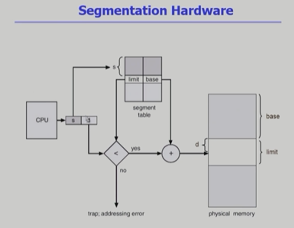

* 길이를 가지고 있어야함(균일하지 않기 때문)
* STLR의 값은 실제 s(segment의 수)보다 커야함. STLR > s여야 통과해서 물리주소를 검색.
* 만족안하면 주소변환 x
* segment도 중간중간 hole이 생김.

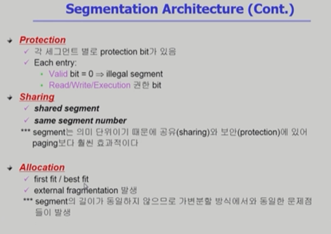

* 의미단위인 Protection, Sharing에서는 세그멘테이션이 유리(공유, 보안)
* 크기가 중요하지 않기 때문에 Allocation에서 외부조각 문제 발생.
* 장점은 의미단위 reading에서 강점을 가짐. 의미단위 권한부여 등

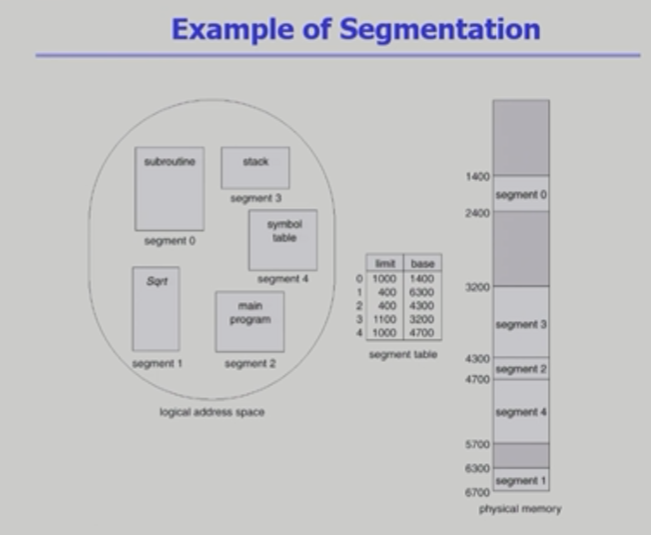

* hole이 생김.

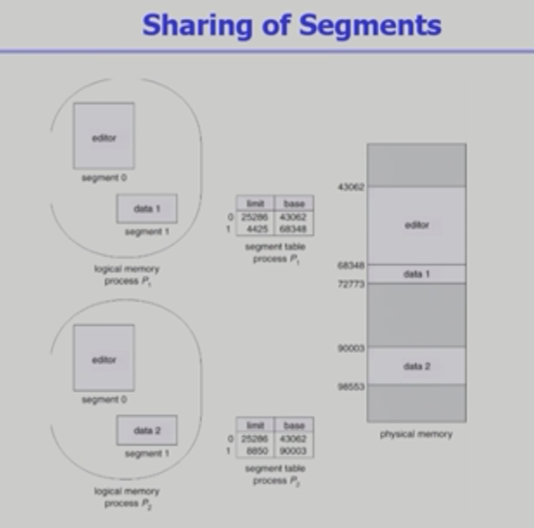

* share되는 editor은 따로 할당.

---

### Segment와 Paging의 혼합.

* 세그먼트를 여러 페이지로 구성.

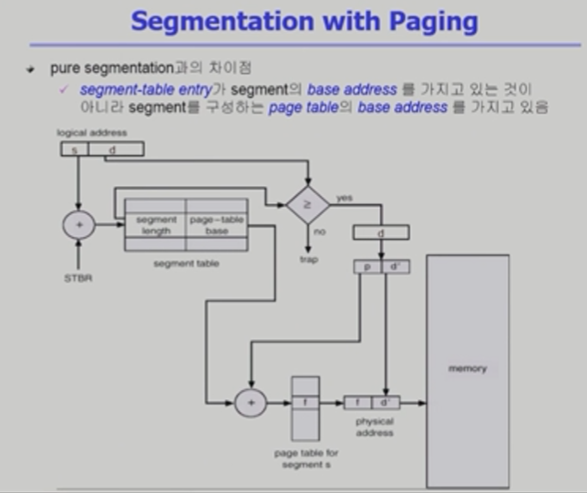

* Segment table로 의미단위 분할 후 memory에 page단위로 쪼개져서 올라감.
* 권한, 공유 등 의미단위는 segment table에서 관리.
* Segment table에 page-table의 base(시작위치) 가 들어있음. s(length)와 d(offset)와의 비교를 통해 타당성 검증.

