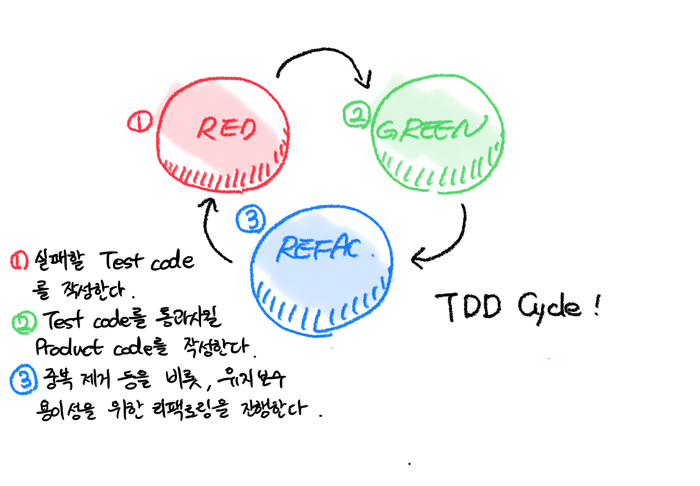
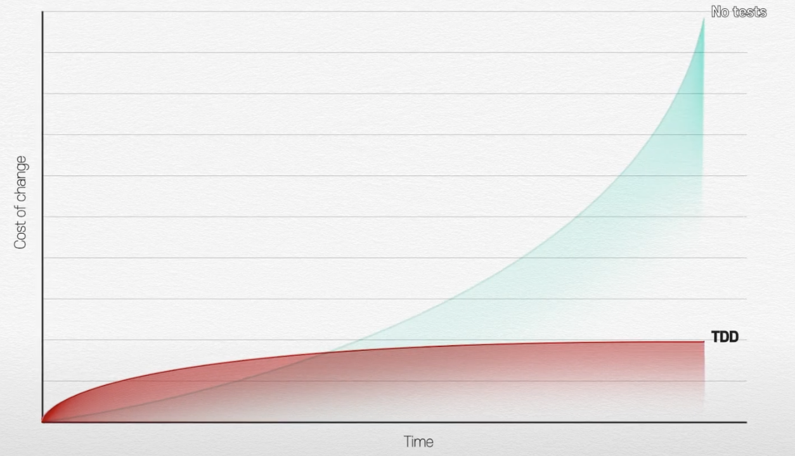

# TDD 테스트 주도 개발

## TDD란?

### 누가 만들었나?

Kent Beck이라는 분이 Extreme Programming을 발표하며 2003년에 제안

- 미국의 SW 엔지니어
- Extreme Programming의 창시자
  - 요구사항이 급변하는 분야에 적합한 개발 방법론
    - Whole Team / Planning Game / Customer Tests / Small Releases / Simple Design / **Test-Driven Developement** / Pair Programming

### 그래서 이게 뭔데

* 결론부터 간단히 말하자면, 테스트 코드를 먼저 짜고 그 이후에 프로덕트 코드를 짜는 방법
  1. 요구사항 파악
  2. 요구 사항에 걸맞는 테스트 케이스 작성
  3. 테스트코드 작성
  4. 테스트 코드가 돌아가도록 프로덕트 코드 작성
  5. 리팩토링
  6. 경우에 따라 1번 혹은 2번으로 돌아가서 반복

### TDD 싸이클



### 도대체 어떻게 하는건데? 
* Test code를 작성하고, Testable한 Product Code를 적용해 기능 단위로 독립적으로 테스트한다.
#### Refac을 통한 Testable Code 작성법

예시 : 프렌즈 4블록

```python
# yoonbaek.py 
def solution(m, n, board):
    cnt = 0
    board = [[char for char in word] for word in board]

    def explode():
        exp_set = set()
        for row in range(m-1):
            for col in range(n-1):
                if board[row][col] and board[row][col] == board[row][col+1] == board[row+1][col] == board[row+1][col+1]:
                    exp_set.add((row, col)) 
                    exp_set.add((row, col+1)) 
                    exp_set.add((row+1, col))
                    exp_set.add((row+1, col+1))
        
        for row, col in exp_set:
            board[row][col] = 0

        return len(exp_set)
    

    def gravity():
        stack = []
        for col in range(n):
            for row in range(m):
                if board[row][col]:
                    stack.append(board[row][col])
                    board[row][col] = 0
            while stack:
                board[row][col] = stack.pop()
                row -= 1

    while 1:
        blocks = explode()
        if not blocks:
            break 
        cnt += blocks
        gravity()

    return cnt 
```

1. 관심사의 분리 (Independent)

```python
## Input을 처리하는 기능
def string_array_to_2d_array(board):
    board = [[char for char in word] for word in board]
    return board
## 2 by 2 블록을 찾는 기능 (생략)
def find_2_by_2_blocks():
    pass
## 블록을 폭발 시키는 기능 (생략)
def blow_blocks():
    pass
## 빈 공간을 메꾸는 기능
def gravity():
    pass
## 전체 기능
class friend_4_blocks_game:
    pass
```

1-2. 들여쓰기를 기준으로 분리해 보기

​	오직 한 덩어리의 들여쓰기 (indent)를 한다.

```python
def explode():
    exp_set = set()
    for row in range(m-1):
        for col in range(n-1):
            if board[row][col] and board[row][col] == board[row][col+1] == board[row+1][col] == board[row+1][col+1]:
                exp_set.add((row, col)) 
                exp_set.add((row, col+1)) 
                exp_set.add((row+1, col))
                exp_set.add((row+1, col+1))
                
    for row, col in exp_set:
        board[row][col] = 0

    return len(exp_set)
```

```python
# indent 단위 기능구분
def explode(board):
	def find_2_by_2_blocks():
        exp_set = set()
        for row in range(m-1):
            for col in range(n-1):
                if board[row][col] and board[row][col] == board[row][col+1] == board[row+1][col] == board[row+1][col+1]:
                    exp_set.add((row, col)) 
                    exp_set.add((row, col+1)) 
                    exp_set.add((row+1, col))
                    exp_set.add((row+1, col+1))

        return exp_set


    def blow_blocks(target: set):
        blow_cnt = 0
        for row, col in target_set:
            blow_cnt += 1
            board[row][col] = 0

        return blow_cnt

    target = find_2_by_2_blocks(board)
   	if target:
        result = blow_blocks(target)
   	else:
        result = 0
        
    return result
```

2. else를 하지 않는다
* 더 간결한 코드를 얻을 수 있다.

```python
# with else
def explode():
    def find_2_by_2_blocks():
        pass
    def blow_blocks():
        pass
    
    target = find_2_by_2_blocks(board)
   	if target:
        result = blow_blocks(target)
   	else:
        result = 0
        
    return result
```
```python
# without else
def explode():
    def find_2_by_2_blocks():
        pass
    def blow_blocks():
        pass
    
    target = find_2_by_2_blocks(board)
   	if not target:
        return 0
    result = blow_blocks(target)
    
    return result
```

3. 로컬변수가 반드시 필요한가?
   * 블럭을 찾은 경우에만 블록을 날린다고 직관적으로 알 수 있음

```python
def explode():
    def find_2_by_2_blocks():
        pass
    def blow_blocks():
        pass
    
    target = find_2_by_2_blocks(board)
   	if not target:
        return 0
    return blow_blocks(target)
```

4. 추상화 정도가 같은가?
   * 추상화된 언어 정보로 이해할 수 있는가?
```python
# yoonbaek.py 
def solution(m, n, board):
    def string_array_to_2d_array():
        pass
    
    def is_exists(value):
        return True if value else False
	
    def explode():
        def find_2_by_2_blocks():
            pass
        def blow_blocks():
            pass

        target = find_2_by_2_blocks(board)
        # 추상화한 부분
        if not is_exists(target):
            return 0
        return blow_blocks(target)

    def gravity():
        pass

    board = string_array_to_2d_array()
    while 1:
        blocks = explode()
        # 추상화한 부분
        if not is_exists(block):
            break 
        cnt += blocks
        gravity()

    return cnt 
```

## 왜 TDD를 해야 할까?

### 외부적 요인

* 많은 오픈 소스들이 테스트코드를 갖고 있음.
  * Contribute을 위해서 어떻게 작동하는지 이해하려면 무조건 테스트 코드를 봐야함.
* 취업시장에서 테스트 코드를 작성해봤는지 여부를 묻는 면접 사례가 늘고 있음

### TDD의 장점

- 어떠한 경우에도 동작하는 코드에 대한 자신감
  - **Clean Code that works**
- **오버 엔지니어링을 방지**해준다.
  - 테스트코드를 작성하며 꼭 필요한 기능만 설계인지 고려
- 테스트 코드 작성을 통해 자연스럽게  **Executable documentation**을 할 수 있다.
  - 누구나 알아보기 쉽게 추상화를 하고,
  - 각 기능 단위로 독립적으로 작동하기 때문
  - 심지어 이 문서는 실행도 가능하다.
- Extreme Programming에 걸맞는 설계적 유연성과 독립성
  - 비즈니스 니즈가 변해서 A를 고칠 일이 생길 때, Test Code는 독립되어 있기 때문에 콕 집어서 해결할 수 있음

### 그럼 무조건 TDD?

* TDD는 엄밀히 말하면 일을 두번하는 것. 
* Product 코드와 Test 코드 작성이라는 두가지 Task를 하는 것임

TDD는 초기에 비용이 많이 들지만, 프로젝트의 규모가 커질 수록 시간 비용이 로그 함수의 형태를 띄게 됨
프로덕트의 크기에 걸맞는 시간 비용 곡선을 고려하면서 TDD를 적용하는 것이 바람직하다.

